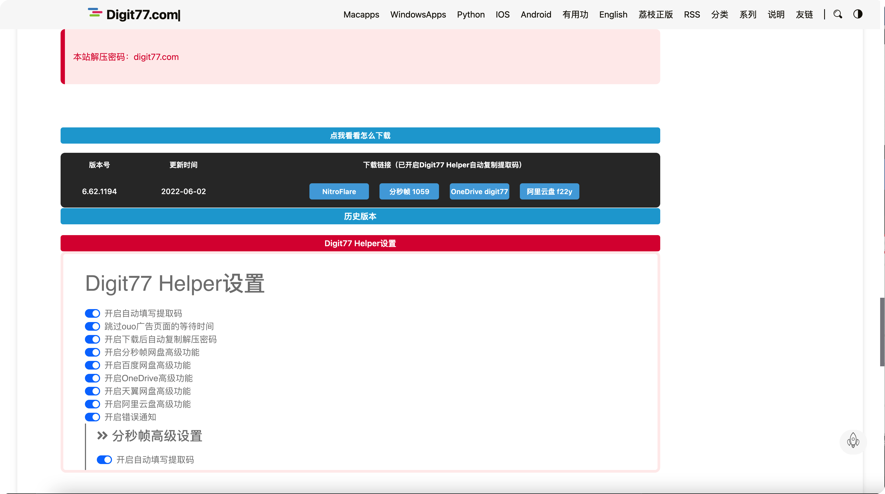
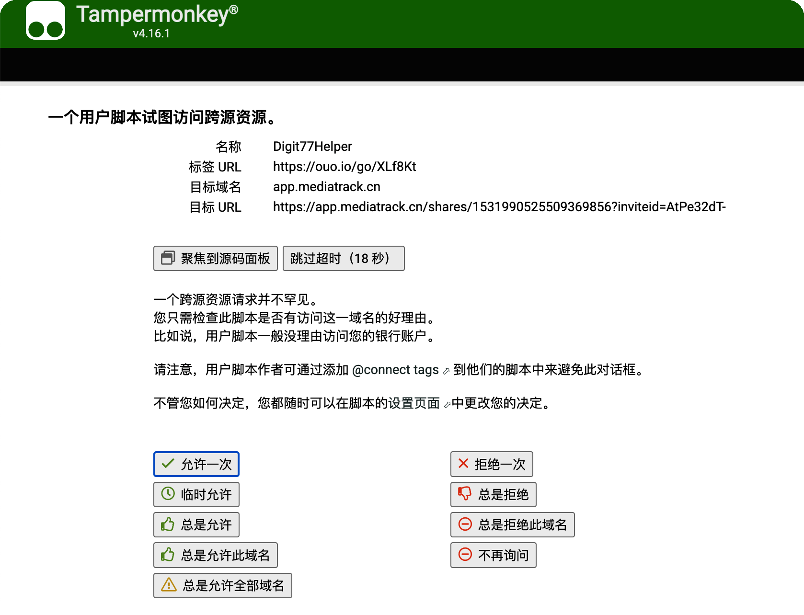

  

<h1 align="center">Digit77 Helper</h1>

  <strong>👉 自动复制下载网址的提取码 自动跳过广告链接的等待时间 网盘自动填写提取码、自动下载、自动保存！
   👈</strong> 
  适用于<a herf="https://www.digit77.com/">Digit77.com Mac精品应用免费分享网</a>的油猴脚本

**Digit77网页助手油猴脚本**。自动复制下载网址的提取码 自动跳过广告链接的等待时间 网盘自动填写提取码、自动下载、自动保存！

[在greasyfork查看](https://greasyfork.org/zh-CN/scripts/445961-digit77-helper)

[在GitHub查看](https://github.com/XYZliang/Digit77Helper)

## 💽 安装地址

- [**greasyfork下载地址（如果网络支持，更新最快）**](https://greasyfork.org/scripts/445961-digit77-helper/code/Digit77%20Helper.user.js)
- **[全球快速下载地址凯速云（推荐）](https://download.kstore.space/download/2078/Digit77Helper/Digit77Helper.js)**
- [全球备用下载地址千牛云](https://qianniuossplus.jxufesoftware.club/Digit77Helper.js)
- [github下载地址](https://github.com/XYZliang/Digit77Helper/raw/main/Digit77%20Helper.user.js)

## 🔧 助手配置

进入[Digit77.com Mac精品应用免费分享网](https://www.digit77.com/)后，在软件下载页面的下载框后出现一个配置选项，点击即可进入设置：（注意翻到底部点击保存设置！）

## 💯 常见问题

💡 **总是碰到一个用户脚本试图访问跨园资源的提示？**

A：为了能无需通过用户剪贴板进行提取码的传输，我们需要获取网盘的链接，从而模仿ouo这个广告链接的协议请求真正的网盘链接来进行提取码的传递，**建议点击 总是允许此域名/总是允许全部域名 来防止油猴插件多次弹出提醒**。如果拒绝，脚本会自动复制提取码到剪贴板，请自行粘贴提取码。

💡 **助手安全吗？**

A：助手免费开源，代码均在本地运行，获Digit77 Helper站长推荐。

## 👻 BUG反馈

如果您在使用过程中有无法识别的文本，请 [在GitHub提交issues](https://github.com/XYZliang/Digit77Helper/issues) 进行反馈。

## 📜ToDo

- [x] 自动复制提取码
- [x] 跳过ouo的等待时间
- [x] 实现分秒帧自动填写提取码、自动开始下载、自动保存、自动收藏
- [x] 实现OneDrive自动填写提取码、自动开始下载
- [x] 实现天翼云盘自动填写提取码、自动下自动转存到云盘、自动开始下载
- [x] 实现阿里云盘自动填写提取码、自动下自动转存到云盘、自动开始下载
- [x] UI设置界面
- [x] 下载后复制解压密码digit77.com
- [ ] 实现国外版digit77的脚本

## 📖 更新日志

**v2.3** 加入下载后自动复制解压密码的功能digit77.com

**v2.2** 完善文档，加入多个下载地址，修复初始化bug，修复分秒帧卡在最后一步确定

**v2.1** 添加Web设置页面

**v2.0** 加入对onedrive 阿里云盘 天翼云盘 的支持，

**v1.2** 加入对分秒帧网盘的支持

**v1.1** 取消自动复制剪切板，由程序自动记录

**v1.0** ouo广告自动跳转，提取码自动复制到剪贴板

## 🫶🏼 特别鸣谢

感谢Digit77.com站长的公益分享和对本插件的支持

感谢[网盘智能识别助手](https://github.com/syhyz1990/panAI)，引用部分代码实现对天翼和阿里网盘的支持

感谢[凯速网](https://my.ksust.com/kstore.htm)提供的[免费网盘和静态资源储存](https://my.ksust.com/kstore.htm?aff=2078)，实现设置页面和全球高速脚本下载

感谢千牛云提供的OSS和全球CDN作为备用下载
